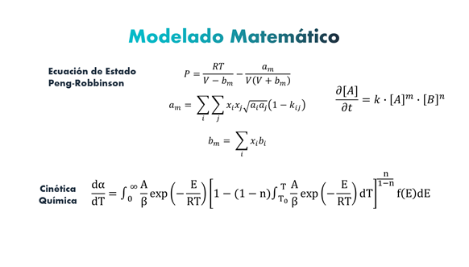

# PyConEs 2021 

## _**Charla: La Química en Python con Algoritmos Estocásticos**_

Participación y colaboración del Equipo de trabajo de la Universidad de Guanajuato por parte del _**Departamento de Ingeniería Química**_ de la **División de Ciencias Naturales y Exactas**.

## Miembros del Equipo

| Participante(s)                     | Actividad Laboral/Academica    |
| ----------------------------------- |:---------------------------:   |
| _Dr. Julián Cabrera_                | Profesor-Investigador          |
| _Jesús Armando López García_        | Estudiante/Google DSC Lead     |
| _Victor Enrique Casillas Céspedes_  | Sector Industrial              |
| _Francisco Daniel Alcatará Maciel_  | Estudiante de Licenciatura     |

El trabajo esta enfocado a la parte de optimización de procesos químicos mediante simulaciones numericas aplicando una versión adaptada del _**Algoritmo Simulated Annealing**_ (Recocido Simulado). 

## Investigación 

El desarrollo del presente trabajo es derivado del interes que surge en el sector industrial de mejorar el rendimiento de procesos químicos mediante la representación de simulaciones en condiciones controladas para la _**disminución de carga termicá así como costos de equipo y servicios**_ usados en un proceso industrial. En esta ocasión el proyecto se enfocó en la **Destilación Reactiva**.

## Modelo Matemático

## Slides y Video
Revisa los slides [aquí](https://ugtomx-my.sharepoint.com/:p:/g/personal/jalopezgarcia_ugto_mx/EX5-6hJOC0ZOgDn7asnlhS4BxiA1G8R8CzCYkgAaHdm0bQ?e=SkdWEh)

Revisa el video [aquí](https://www.youtube.com/watch?v=r7RiQ_PPJlU&t=16738s)
Participación apartir de la hora 4:40 min
